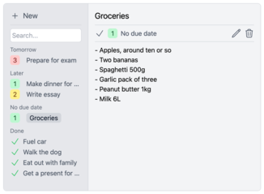
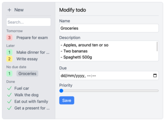

# todoapp ✅
A simple todo app built using NextJS 13, to try out the new features. Persists to local storage only,
supports basic features only. You can try it out at [https://todo.simonvreman.nl/](https://todo.simonvreman.nl/).

 

## Tech stack ✨
- NextJS 13
- TailwindCSS
- MobX

## Running locally 💨
Install dependencies using `npm install` then run using `npm run dev`.

## License 📜
[MIT](license)